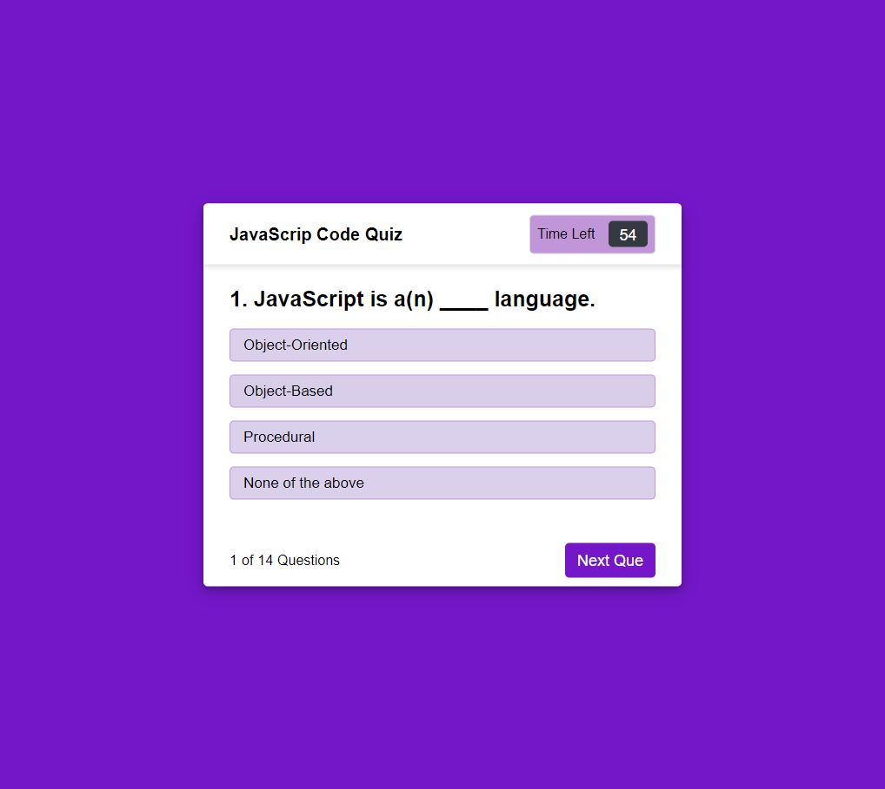

# javascript-code-quiz

## Purpose

The purpose of this webpage is to provide a JavaScript quiz for people to take. The quiz is 14 questions long and the user is allotted 75 seconds to complete the quiz. If the user answers  a question correctly, they score a point. When a question is answered incorrectly, they lose 5 seconds off the timer. When all questions are answered or the timer reaches zero, the quiz ends and displays results to the user. The user is able to enter their initials in the text box and hit the save score button so save their score to localStorage.

## Built With
*HTML
*CSS
*JS

### Web Link:

### Screenshot
